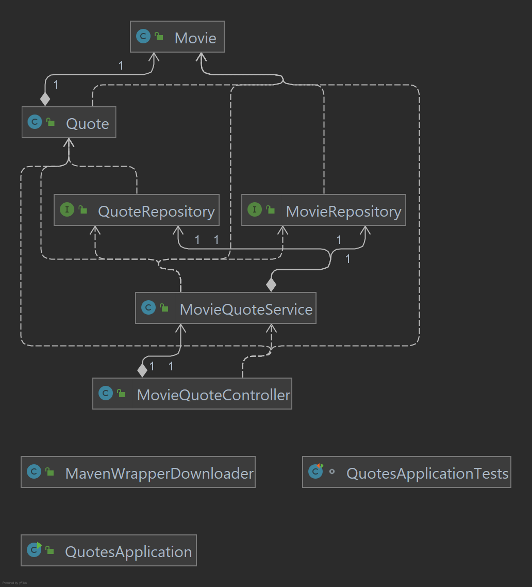

### 3.1

b)

* **The “UserController” class gets an instance of “userRepository” through its constructor; how is this new repository instantiated?**

  The repository is automatically instantiated thanks to the "`@Autowired`" annotation in the `UserController` constructor.

  

* **List the methods invoked in the “userRepository” object by the “UserController”. Where are these methods defined?**

  The methods invoked are:

  * `findAll`
  * `save`
  * `findById`
  * `delete`

  They're defined in the `CrudRepository` class, which `UserRepository` extends.

  

* **Where is the data being saved?**

  The data is being saved in memory. 

  

* **Where is the rule for the “not empty” email address defined?**

  The rule for the "not empty" email address field is defined through the `@NotBlank(message = "Email is mandatory")` annotation above the declaration `private String email;`.

​	

### 3.2

Guide followed to get the Docker MySQL DB working: https://medium.com/tech-learn-share/docker-mysql-access-denied-for-user-172-17-0-1-using-password-yes-c5eadad582d3

**Examples of some requests sent through Postman**

1. HTTP Method: **POST** , Request URL: http://localhost:8080/api/v1/employees 

   Body:

   `{"firstName": "John", "lastName": "Cena", "emailId": "johncena@gmail.com"}`

   Response:

   `{"id": 1, "firstName": "John", "lastName": "Cena", "emailId": "johncena@gmail.com"}`

2. HTTP Method: **GET**, Request URL: http://localhost:8080/api/v1/employees/1

   Response:

   `{"id": 1, "firstName": "John", "lastName": "Cena", "emailId": "johncena@gmail.com"}`

Before 3, I added a few more employees.

3. HTTP Method: **GET**, Request URL: http://localhost:8080/api/v1/employees

   Response:

   `[`

     `{"id": 1, "firstName": "John", "lastName": "Cena",`

   ​    `"emailId": "johncena@gmail.com"},`

     `{"id": 3, "firstName": "Dwight", "lastName": "Schrute", `

   ​    `"emailId": "dwight@m.com"},`

     `{"id": 4, "firstName": "Jim", "lastName": "Halpert",`

   ​    `"emailId": "jim@m.com"}`

   `]`

4. HTTP Method: PUT, Request URL: http://localhost:8080/api/v1/employees/1

   Body:

   `{"firstName": "Pam", "lastName": "Beesly", "emailId": "pam@m.com"}`

   Response:

   `{"id": 1, firstName": "Pam", "lastName": "Beesly", "emailId": "pam@m.com"}`

5. HTTP Method: DELETE, Request URL: http://localhost:8080/api/v1/employees/3

   Response:

   `{"deleted": true}`

### Review Questions

**A) Explain the differences between the RestController and Controller components used in different parts of this lab**

The @RestController annotation is a combination of the @Controller and @ResponseBody annotations. It simplifies the development of RESTful Web Services.

Responses from web apps are normally intended for human viewers, and thus usually presented as HTML. In contrast, REST APIs return data in formats like JSON or XML, because their intended clients are programs, not people.

Using the @RestController annotation saves us the hassle of using @ResponseBody on every handler method.

**B) Create a visualization of the Spring Boot layers (UML diagram or similar), displaying the key abstractions in the solution of 3.3, in particular: entities, repositories, services and REST controllers. Describe the role of the elements modeled in the diagram**

| Layer                                     | Role                                                         | Files in 3.3                         |
| ----------------------------------------- | ------------------------------------------------------------ | ------------------------------------ |
| Controller (Presentation Layer/API Layer) | The UI of the application; it presents the features and data to the user. | `MovieQuoteController`               |
| Service/Business Layer                    | Contains the business logic that drives the app's core functionalities. | `MovieQuoteService`                  |
| Repositories (Data Access Object layer)   | Interact with the database to save and restore app data.     | `MovieRepository`, `QuoteRepository` |
| Entities (Models)                         | Lightweight persistence domain objects; they typically represent tables in a relational database, and each instance corresponds to a row. | `Movie`, `Quote`                     |

The diagram (diagram.png) is located in the same directory as this README.

**C) Explain the annotations @Table, @Column, @Id found in the Employee entity**

@Table maps entities to database tables.

@Column specifies the mapped column for a persistent property or field.

@Id specifies the primary key of an entity.

**D) Explain the use of the annotation @AutoWired (in the Rest Controller class).**

@Autowired allows Spring to resolve and inject collaborating beans into our bean. In the case of 3.3, it makes it so that we don't need to instantiate the Service component. 

